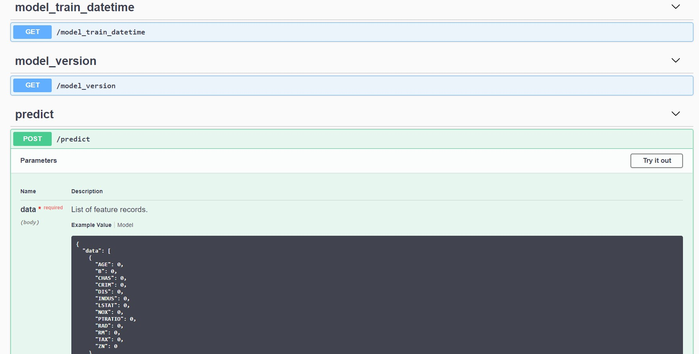

#WIP

## Installation
```bash
pip install git+https://github.com/jesrav/mlmodels#egg=mlmodels
```
To install dependencies for examles
```bash
pip install -r examples/requirements.txt
```
## Base class for ML models
The BaseModel class is an abstract class that enforces child classes to implement
- A MODEL_NAME attribute
- A fit method
- A predict method

It gives you the time the model was fitted plus serialization and deserialization out of the box.

```python
from mlmodels import BaseModel

class DummyModel(BaseModel):
    MODEL_NAME = 'Dummy model'
    
    def fit(self, X, y):
        pass

    def predict(self, X):
        return len(X)*[1]

dummy_model = DummyModel()

# Save model
dummy_model.save(fname='model.pickle')

# Load model
loaded_model = DummyModel().load('model.pickle')

# When was the model initialized?
dummy_model.model_initiated_dt
# Returns:  datetime.datetime(2020, 2, 12, 9, 46, 19, 81250)

# Predict
loaded_model.predict([[1, 1], [2, 2]])
```
## Data frame model decorator
The data frame model decorator can be used to add some functionality to a model class that takes a Pandas DataFrame as input and produces predictions in the form of a Pandas Series or DataFrame.
It adds methods for using the features and dtypes of the input dataframe to:
- validate the date frame schema when predicting
- generate an open api specification.

The class you decorate needs to set the following attributes in the init method.
- a features attribute (list of feature names)
- a categorical_columns attribute (list of categorical columns)

### Example use
```python
from sklearn.ensemble import RandomForestRegressor
import pandas as pd
import numpy as np
from sklearn.model_selection import train_test_split
from mlmodels import (
    BaseModel,
    data_frame_model
)

@data_frame_model
class RandomForestRegressorModel(BaseModel):
    MODEL_NAME = 'Random forest model'

    def __init__(
            self,
            features,
            categorical_columns=None,
            random_forest_params={'n_estimators': 100, 'max_depth': 30},
    ):
        super().__init__()
        self.features = features
        self.categorical_columns = categorical_columns
        self.random_forest_params = random_forest_params
        self.model = RandomForestRegressor(**random_forest_params)

    def fit(self, X, y):
        self.model.fit(X[self.features], y)
        return self

    def predict(self, X):
        predictions = self.model.predict(X[self.features])
        return predictions

# Read data
csv_url = 'http://archive.ics.uci.edu/ml/machine-learning-databases/wine-quality/winequality-red.csv'
data = pd.read_csv(csv_url, sep=';')

# Create categorical features
data["group1"] = np.random.choice(3, len(data))
data["group2"] = np.random.choice([3, 7], len(data))

# Split the data into training and test sets. (0.75, 0.25) split.
train, test = train_test_split(data)

# The predicted column is "quality" which is a scalar from [3, 9]
train_x = train.drop(["quality"], axis=1)
test_x = test.drop(["quality"], axis=1)
train_y = train["quality"]
test_y = test["quality"]

# Fit model make predictions and evaluate
features = ["pH", "density", "chlorides", "alcohol", "group1", "group2"]
model = RandomForestRegressorModel(
    features=features,    
    categorical_columns=["group1", "group2"],
    random_forest_params={'n_estimators': 100, 'max_depth': 15},
)
model.fit(train_x, train_y)

predicted_qualities = model.predict(test_x)
```
### Model input schema validation
If the input dataframe does not have the right features or the columns do not have the right dtypes,
you will get an error.
```python
# Example of missing features
model.predict(test_x[["density", "chlorides", "alcohol"]])
# returns: ValueError: The following features must be in X: ['pH', 'density', 'chlorides', 'alcohol', 'group1', 'group2']

# Example of wrong dtype
test_x.density = test_x.density.astype('int64')
model.predict(test_x)
# returns: ValueError: Dtypes must be: {'pH': dtype('float64'), 'density': dtype('float64'), 'chlorides': dtype('float64'), 'alcohol': dtype('float64'), 'group1': dtype('int32'), 'group2': dtype('int32')}
```

## Creating MLFLOW pyfunc model
You can wrap your model with the MLFlowWrapper class, to make your model comply with the mlflow model format.
```python
from mlmodels import MLFlowWrapper
mlflow_model = MLFlowWrapper(model)
```

### Building a docker image with a model service
The model must wrapped as an mlflow.pyfunc model and must have the following 
- get_open_api_dict: Method that returns an open api specification as a dictionary.
- model_input_from_dict: Method that transforms the dictionary model input, from the posted json, to input that can be passed to a predict method.
- MODEL_NAME: Attribute with a model name.
- model_initiated_dt: Attribute indicating when the object was initialized (when the model was trained).

If you decorated a model class with the data_frame_model decorator, you will automatically have the above.
The model must return predictions in an array-like form.  

First we train and save a model locally.
```console
python examples\random_forest_model_example\wine_example.py
```
Then we build a docker image for serving the model as a web API. 
```console
mlmodels dockerize examples\random_forest_model_example\model_output\wine_model 1 model-service:latest
```
To run the model service locally
```console
docker run -p 5000:5000 model-service:latest
```
The swagger specification can be found at http://localhost:5000/apidocs/
