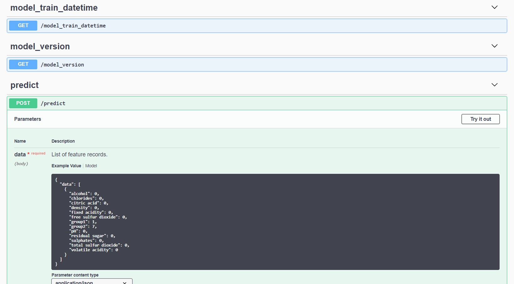

# WIP

## Installation
```bash
pip install git+https://github.com/jesrav/mlmodels
```
To install dependencies for examles
```bash
pip install -r examples/requirements.txt
```
## Base class for ML models
The BaseModel class is an abstract class that enforces child classes to implement
- A MODEL_NAME attribute
- A fit method
- A predict method

It gives you the time the model was fitted plus serialization and deserialization out of the box.

```python
from mlmodels import BaseModel

class DummyModel(BaseModel):
    MODEL_NAME = 'Dummy model'
    
    def fit(self, X, y):
        pass

    def predict(self, X):
        return len(X)*[1]

dummy_model = DummyModel()

# Save model
dummy_model.save(fname='model.pickle')

# Load model
loaded_model = DummyModel().load('model.pickle')

# When was the model initialized?
dummy_model.model_initiated_dt
# Returns:  datetime.datetime(2020, 2, 12, 9, 46, 19, 81250)

# Predict
loaded_model.predict([[1, 1], [2, 2]])
```
## Data frame model mixin class
If you create a model that takes a data frame and outputs a data frame when predicting, you can use the DataFrameModelMixin class to add some functionality.

The DataFrameModelMixin class can be used in combination with the accompanying decorators to infer the feature and target schema on fit and validate new data on predict.
Alternatively one can set the feature and target schema before or after fitting the model.
TODO: Add more details!

### Example use
```python
import pandas as pd
import numpy as np
from sklearn.ensemble import RandomForestClassifier
from sklearn.model_selection import train_test_split

from mlmodels import (
    BaseModel,
    DataFrameModelMixin,
    infer_from_fit,
    ModelMethodColumnInfo,
)


# Create data frame model class where the feature and target schema are inferred when the model is fitted.
@infer_from_fit(
    feature_df_schema=True,
    target_df_schema=True,
    methods_with_features_as_input=['predict'],
    validate_input_output_method_list=['predict']
)
class RandomForestClassifierModel(BaseModel, DataFrameModelMixin):

    def __init__(
            self,
            features,
            random_forest_params={'n_estimators': 100, 'max_depth': 30},
    ):
        super().__init__()
        self.features = features
        self.target_columns = None,
        self.random_forest_params = random_forest_params
        self.model = RandomForestClassifier(**random_forest_params)

    def fit(self, X, y):
        self.model.fit(X[self.features], y)
        self.target_columns = y.columns
        return self

    def predict(self, X):
        predictions_array = self.model.predict(X[self.features])
        predictions_df = pd.DataFrame(
            data=predictions_array, 
            columns=self.target_columns
        )
        return predictions_df


# Read data
csv_url = 'http://archive.ics.uci.edu/ml/machine-learning-databases/wine-quality/winequality-red.csv'
data = pd.read_csv(csv_url, sep=';')

# Create some categorical features
data['group1'] = np.random.choice(3, len(data))
data['group2'] = np.random.choice([3, 7], len(data))
data['group1'] = data['group1'].astype('int64')
data['group2'] = data['group2'].astype('int64')

# Split the data into training and test sets. (0.75, 0.25) split.
train, test = train_test_split(data)

# The predicted column is "quality" which is a scalar from [3, 9]
train_x = train.drop(["quality"], axis=1)
test_x = test.drop(["quality"], axis=1)
train_y = train[["quality"]]
test_y = test[["quality"]]

# Initialize a model
model = RandomForestClassifierModel(
    features=train_x.columns,
    random_forest_params={'n_estimators': 100, 'max_depth': 15},
)

# Set information about columns
model.set_model_method_column_info(
    ModelMethodColumnInfo(
        'predict',
        input_enum_columns=['group1', 'group2'],
        output_enum_columns=['quality'],
        input_interval_columns=['chlorides', 'free sulfur dioxide'],
        input_interval_percent_buffer=25,
    )
)

# Fit model, make predictions and evaluate
model.fit(train_x, train_y)
predicted_qualities = model.predict(test_x)
```
### Model input schema validation
If the input dataframe does not match the data frame schema you will get an error.
```python
# Example of missing features
model.predict(test_x[["density", "chlorides", "alcohol"]])
# returns: pandera.errors.SchemaError: column 'fixed acidity' not in dataframe

# Example of wrong dtype
test_x_copy = test_x.copy()
test_x_copy.density = test_x_copy.density.astype('int64')
model.predict(test_x_copy)
# returns: pandera.errors.SchemaError: expected series 'density' to have type float64, got int64

# Example of wrong categorical value/enum.
test_x_copy = test_x.copy()
test_x_copy.group1 = 100
model.predict(test_x_copy)
# returns: pandera.errors.SchemaError: <Schema Column: 'group1' type=int64> failed element-wise validator 0:
# <Check _isin: isin(frozenset({0, 1, 2}))>

# Example of value outside of accepted interval.
test_x_copy = test_x.copy()
test_x_copy.group1 = 100.0
model.predict(test_x_copy)
# returns: pandera.errors.SchemaError: <Schema Column: 'fixed acidity' type=float64> failed element-wise validator 0:
# <Check _in_range: in_range(1.7749999999999995, 18.725)>
```

## Creating MLFLOW pyfunc model
You can wrap your model with the MLFlowWrapper class, to make your model comply with the mlflow model format.
```python
from mlmodels import MLFlowWrapper
mlflow_model = MLFlowWrapper(model)
```

### Building a docker image with a model service
You can deploy a data frame model as a web service with Open API documentation and validation.
The model must wrapped as an mlflow.pyfunc model and must inherit from the BaseModel and DataFrameModelMixin

To try it out, first we train and save a model locally. You need to use python 3.6.7 or update the python version in examples/random_forest_model_example/conda.yaml.
```console
python examples/wine_example.py
```
Next build a docker image for serving the model using the cli. 
```console
mlmodels dockerize examples/model_output/wine_model 1 model-service:latest
```
To run the model service locally
```console
docker run -p 5000:5000 model-service:latest
```
The swagger specification can be found at http://localhost:5000/apidocs/
